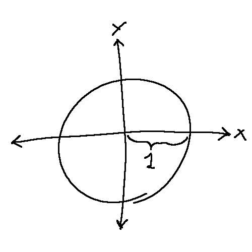
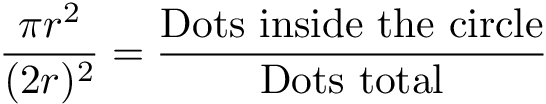
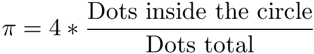
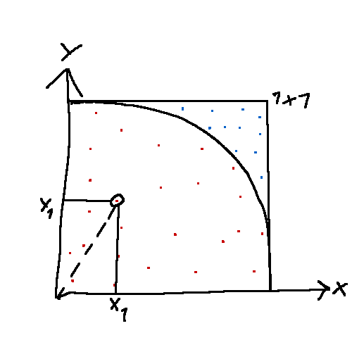

# Finding Pi by random
Proof of concept. The only catch been that it uses a lot of time/energy if you want more accuracy.

### The problem
It is almost easier to understand by formulating it as an problem. Here it goes:
You have only a function that returns a value at random between 0 and 1. How can you find an approximation of the value Pi?

It sounds almost as a joke, but it is possible. 

### Solution
By using the function twice, you will end up with two values that could represent a position in a coordinate. The coordinates would be everywhere inside a 1x1 coordinate. To make it easier, we will know just call them dots.

Lets imagine that the 1x1 coordinate represent the top right corner (1/4) of a entire circle. 
{

We already know what the radius is, and that's great. This make it easier for later math stuff. 
We also need to imagine that the entire circle is inside a square. *Fast math => a (r*2)² square*. 
**Why do you ask**? Because the rational between the area of the square and the circle is magical. 
It will be the same as the relation of the 1/4 circle and the square in our coordinate system (1x1).

Using this knowledge and some mathematical mixing, it is possible to make this

***convert to this!*** 

Now we have the fomula!

**But, how can we know that the dot is inside or outside the circle?** Glad you asked, it's simple. By using our good friend pythagoras theorem we can find the distance of origo(0,0) to the dot. If the distance is more the the radius, one in our case, it's out. You can almost see the code already.

Now by coding all this math with some method of keeping track of the total dots and dots inside the circle, Pi can be found. 

