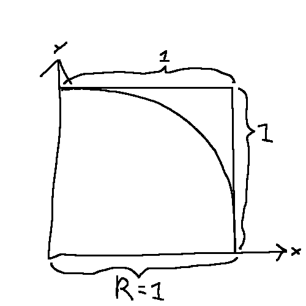

# Finding Pi by random
Proof of concept. The only catch been that it uses a lot of time/energy if you want more accuracy.

### The problem
It is almost easier to understand by formulating it as an problem. Here it goes:
You have only a function that returns a value at random between 0 and 1. How can you find an approximation of the value Pi?

It sounds almost as a joke, but it is possible. 

### Solution
By using the function twice, you will end up with two values that could represent a position in a coordinate. The coordinates would be everywhere inside a 1x1 coordinate. 

Lets imagine that the 1x1 coordinate represent the top right corner (1/4) of a entire circle. 

This circle would have a radius of 1, and a areal of 

